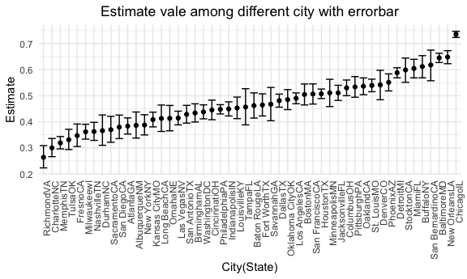

p8105_hw5_wb2366
================

``` r
library(tidyverse)
```

    ## ── Attaching packages ─────────────────────────────────────── tidyverse 1.3.1 ──

    ## ✓ ggplot2 3.3.5     ✓ purrr   0.3.4
    ## ✓ tibble  3.1.4     ✓ dplyr   1.0.7
    ## ✓ tidyr   1.1.3     ✓ stringr 1.4.0
    ## ✓ readr   2.0.1     ✓ forcats 0.5.1

    ## ── Conflicts ────────────────────────────────────────── tidyverse_conflicts() ──
    ## x dplyr::filter() masks stats::filter()
    ## x dplyr::lag()    masks stats::lag()

``` r
library(ggplot2)
knitr::opts_chunk$set(
  fig.width = 6,
  fig.asp = .6,
  out.width = "90%"
)

theme_set(theme_minimal() + theme(legend.position = "bottom"))
```

## Problem1

**Gather the data**

``` r
homicides_raw <- read_csv("./homicide-data.csv")
```

    ## Rows: 52179 Columns: 12

    ## ── Column specification ────────────────────────────────────────────────────────
    ## Delimiter: ","
    ## chr (9): uid, victim_last, victim_first, victim_race, victim_age, victim_sex...
    ## dbl (3): reported_date, lat, lon

    ## 
    ## ℹ Use `spec()` to retrieve the full column specification for this data.
    ## ℹ Specify the column types or set `show_col_types = FALSE` to quiet this message.

**Describe the raw data**

For this homicides raw dataset, it contains `52179` observations and
`12` variables, which are respectively
`uid, reported_date, victim_last, victim_first, victim_race, victim_age, victim_sex, city, state, lat, lon, disposition`

**Create a city_state variable and then summarize within cities to
obtain the total number of homicides and the number of unsolved
homicides**

``` r
homicides_df <- homicides_raw %>%
  janitor::clean_names() %>%
  mutate(
    city_state = str_c(city, '', state),
    homicides_status = case_when(
      disposition == "Closed without arrest" ~ "unsolved",
      disposition == "Open/No arrest" ~ "unsolved",
      disposition == "Closed by arrest" ~ "solved"
    )
  ) %>% 
  filter(city_state != "TulsaAL") %>% 
  relocate(city_state)
```

``` r
homicides_df %>%
  group_by(city_state, homicides_status) %>%
  tally() %>%
  knitr::kable()
```

| city_state       | homicides_status |    n |
|:-----------------|:-----------------|-----:|
| AlbuquerqueNM    | solved           |  232 |
| AlbuquerqueNM    | unsolved         |  146 |
| AtlantaGA        | solved           |  600 |
| AtlantaGA        | unsolved         |  373 |
| BaltimoreMD      | solved           | 1002 |
| BaltimoreMD      | unsolved         | 1825 |
| Baton RougeLA    | solved           |  228 |
| Baton RougeLA    | unsolved         |  196 |
| BirminghamAL     | solved           |  453 |
| BirminghamAL     | unsolved         |  347 |
| BostonMA         | solved           |  304 |
| BostonMA         | unsolved         |  310 |
| BuffaloNY        | solved           |  202 |
| BuffaloNY        | unsolved         |  319 |
| CharlotteNC      | solved           |  481 |
| CharlotteNC      | unsolved         |  206 |
| ChicagoIL        | solved           | 1462 |
| ChicagoIL        | unsolved         | 4073 |
| CincinnatiOH     | solved           |  385 |
| CincinnatiOH     | unsolved         |  309 |
| ColumbusOH       | solved           |  509 |
| ColumbusOH       | unsolved         |  575 |
| DallasTX         | solved           |  813 |
| DallasTX         | unsolved         |  754 |
| DenverCO         | solved           |  143 |
| DenverCO         | unsolved         |  169 |
| DetroitMI        | solved           | 1037 |
| DetroitMI        | unsolved         | 1482 |
| DurhamNC         | solved           |  175 |
| DurhamNC         | unsolved         |  101 |
| Fort WorthTX     | solved           |  294 |
| Fort WorthTX     | unsolved         |  255 |
| FresnoCA         | solved           |  318 |
| FresnoCA         | unsolved         |  169 |
| HoustonTX        | solved           | 1449 |
| HoustonTX        | unsolved         | 1493 |
| IndianapolisIN   | solved           |  728 |
| IndianapolisIN   | unsolved         |  594 |
| JacksonvilleFL   | solved           |  571 |
| JacksonvilleFL   | unsolved         |  597 |
| Kansas CityMO    | solved           |  704 |
| Kansas CityMO    | unsolved         |  486 |
| Las VegasNV      | solved           |  809 |
| Las VegasNV      | unsolved         |  572 |
| Long BeachCA     | solved           |  222 |
| Long BeachCA     | unsolved         |  156 |
| Los AngelesCA    | solved           | 1151 |
| Los AngelesCA    | unsolved         | 1106 |
| LouisvilleKY     | solved           |  315 |
| LouisvilleKY     | unsolved         |  261 |
| MemphisTN        | solved           | 1031 |
| MemphisTN        | unsolved         |  483 |
| MiamiFL          | solved           |  294 |
| MiamiFL          | unsolved         |  450 |
| MilwaukeewI      | solved           |  712 |
| MilwaukeewI      | unsolved         |  403 |
| MinneapolisMN    | solved           |  179 |
| MinneapolisMN    | unsolved         |  187 |
| NashvilleTN      | solved           |  489 |
| NashvilleTN      | unsolved         |  278 |
| New OrleansLA    | solved           |  504 |
| New OrleansLA    | unsolved         |  930 |
| New YorkNY       | solved           |  384 |
| New YorkNY       | unsolved         |  243 |
| OaklandCA        | solved           |  439 |
| OaklandCA        | unsolved         |  508 |
| Oklahoma CityOK  | solved           |  346 |
| Oklahoma CityOK  | unsolved         |  326 |
| OmahaNE          | solved           |  240 |
| OmahaNE          | unsolved         |  169 |
| PhiladelphiaPA   | solved           | 1677 |
| PhiladelphiaPA   | unsolved         | 1360 |
| PhoenixAZ        | solved           |  410 |
| PhoenixAZ        | unsolved         |  504 |
| PittsburghPA     | solved           |  294 |
| PittsburghPA     | unsolved         |  337 |
| RichmondVA       | solved           |  316 |
| RichmondVA       | unsolved         |  113 |
| SacramentoCA     | solved           |  237 |
| SacramentoCA     | unsolved         |  139 |
| San AntonioTX    | solved           |  476 |
| San AntonioTX    | unsolved         |  357 |
| San BernardinoCA | solved           |  105 |
| San BernardinoCA | unsolved         |  170 |
| San DiegoCA      | solved           |  286 |
| San DiegoCA      | unsolved         |  175 |
| San FranciscoCA  | solved           |  327 |
| San FranciscoCA  | unsolved         |  336 |
| SavannahGA       | solved           |  131 |
| SavannahGA       | unsolved         |  115 |
| St. LouisMO      | solved           |  772 |
| St. LouisMO      | unsolved         |  905 |
| StocktonCA       | solved           |  178 |
| StocktonCA       | unsolved         |  266 |
| TampaFL          | solved           |  113 |
| TampaFL          | unsolved         |   95 |
| TulsaOK          | solved           |  390 |
| TulsaOK          | unsolved         |  193 |
| WashingtonDC     | solved           |  756 |
| WashingtonDC     | unsolved         |  589 |

**For the city of Baltimore,MD**

``` r
Baltimore_summarize = homicides_df %>%
  filter(city_state == "BaltimoreMD") %>%   
  summarize(
    unsolved = sum(homicides_status == "unsolved"),
    n = n()
  )
  
Baltimore_test = 
  prop.test(
    x = Baltimore_summarize %>% pull(unsolved),
    n = Baltimore_summarize %>% pull(n))

Baltimore_test %>% 
  broom::tidy()
```

    ## # A tibble: 1 × 8
    ##   estimate statistic  p.value parameter conf.low conf.high method    alternative
    ##      <dbl>     <dbl>    <dbl>     <int>    <dbl>     <dbl> <chr>     <chr>      
    ## 1    0.646      239. 6.46e-54         1    0.628     0.663 1-sample… two.sided

**Prop.test for each of the cities**

``` r
prop_test_function <- function(city_df) {
  
  city_summarize =
    city_df %>%
    summarize(unsolved = sum(homicides_status == "unsolved"),
              n = n())
  
  city_test =
    prop.test(x = city_summarize %>% pull(unsolved),
              n = city_summarize %>% pull(n))
  
  return(city_test)
}
```

``` r
nested_df <- 
  homicides_df %>%
  nest(data = uid:homicides_status) %>% 
  mutate(
    test_results = map(data, prop_test_function),
    tidy_results = map(test_results, broom::tidy)
  ) %>% 
  select(city_state, tidy_results) %>% 
  unnest(tidy_results) %>% 
  select(city_state, estimate, starts_with("conf"))
```

**Create a plot**

``` r
nested_df %>%
  mutate(city_state = fct_reorder(city_state, estimate)) %>%
  ggplot(aes(x = city_state, y = estimate)) +
  geom_point() +
  geom_errorbar(aes(ymin = conf.low, ymax = conf.high)) +
  theme(axis.text.x = element_text(angle = 90, hjust = 1), 
        plot.title = element_text(hjust = 0.5)) +
  labs(title = "Estimate vale among different city with errorbar",
       x = "City(State)",
       y = "Estimate") 
```



## Problem2

**Create a tidy dataframe containing data from all participants,
including the subject ID, arm, and observations over time**

``` r
study_df_header <- list.files(path = "./data-2", pattern = "csv") %>% 
  as.data.frame() %>% 
  rename(subject_id = 1)

study_df_data <- list.files(path = "./data-2", pattern = "csv", full.names = T) %>% 
  map_df(read.csv) %>% 
  cbind(study_df_header,.) %>% 
  mutate(subject_id = str_sub(subject_id, end = 6)) %>% 
  separate(col = subject_id, into = c("arm", "subject_id")) %>% 
  pivot_longer(week_1:week_8,
               names_to = "week",
               values_to = "score")
```

**Make a spaghetti plot showing observations on each subject over time,
and comment on differences between groups.**

``` r
study_df_data %>%
  mutate(arm = case_when(arm == "con" ~ "Control",
                         arm == "exp" ~ "Experiment")) %>%
  ggplot(aes(
    x = week,
    y = score,
    color = arm,
    group = interaction(arm, subject_id)
  )) +
  geom_line() +
  labs(title = "Data observated on each subject over time for two arms",
       x = "Week",
       y = "Data for the longitudinal study") +
  scale_x_discrete(labels = c(
    "Week 1",
    "Week 2",
    "Week 3",
    "Week 4",
    "Week 5",
    "Week 6",
    "Week 7",
    "Week 8"
  )) +
  theme(plot.title = element_text(hjust = 0.5)) +
  viridis::scale_color_viridis(discrete = TRUE)
```


**Answer:** According to the “spaghetti” plot, when concentrating on the
difference between two groups, we are easy to figure out that the mean
data value for experiment arm is obviously larger than the mean data
value for control arm.

## Problem3

``` r
set.seed(10)

iris_with_missing = iris %>% 
  map_df(~replace(.x, sample(1:150, 20), NA)) %>%
  mutate(Species = as.character(Species))
```

**Write a function that takes a vector as an argument**

``` r
fill_missing = function(x){
  
  if(is.numeric(x)){
    x = replace(x, is.na(x), mean(x, na.rm = T))
  }
  else if(is.character(x)){
    x = replace(x, is.na(x), "virginica")
  }
  
  return(x)
}
```

**replaces missing values using the rules defined above**

``` r
iris_df = map_df(.x = iris_with_missing, ~ fill_missing(.x))
```
