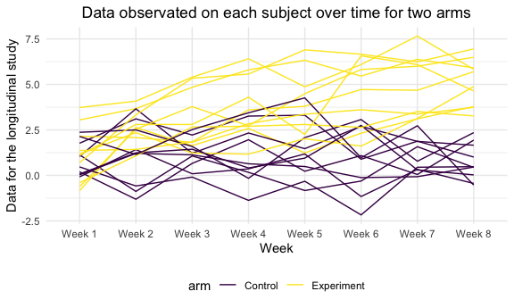

p8105_hw5_wb2366
================

``` r
library(tidyverse)
```

    ## ── Attaching packages ─────────────────────────────────────── tidyverse 1.3.1 ──

    ## ✓ ggplot2 3.3.5     ✓ purrr   0.3.4
    ## ✓ tibble  3.1.4     ✓ dplyr   1.0.7
    ## ✓ tidyr   1.1.3     ✓ stringr 1.4.0
    ## ✓ readr   2.0.1     ✓ forcats 0.5.1

    ## ── Conflicts ────────────────────────────────────────── tidyverse_conflicts() ──
    ## x dplyr::filter() masks stats::filter()
    ## x dplyr::lag()    masks stats::lag()

``` r
library(ggplot2)
knitr::opts_chunk$set(
  fig.width = 6,
  fig.asp = .6,
  out.width = "90%"
)

theme_set(theme_minimal() + theme(legend.position = "bottom"))
```

## Problem1

**Gather the data**

``` r
homicides_raw <- read_csv("./homicide-data.csv")
```

    ## Rows: 52179 Columns: 12

    ## ── Column specification ────────────────────────────────────────────────────────
    ## Delimiter: ","
    ## chr (9): uid, victim_last, victim_first, victim_race, victim_age, victim_sex...
    ## dbl (3): reported_date, lat, lon

    ## 
    ## ℹ Use `spec()` to retrieve the full column specification for this data.
    ## ℹ Specify the column types or set `show_col_types = FALSE` to quiet this message.

**Describe the raw data**

For this homicides raw dataset, it contains `52179` observations and
`12` variables, which are respectively
`uid, reported_date, victim_last, victim_first, victim_race, victim_age, victim_sex, city, state, lat, lon, disposition`

**Create a city_state variable and then summarize within cities to
obtain the total number of homicides and the number of unsolved
homicides**

``` r
homicides_df <- homicides_raw %>%
  janitor::clean_names() %>%
  mutate(
    city_state = str_c(city, '_', state),
    homicides_status = case_when(
      disposition == "Closed without arrest" ~ "unsolved",
      disposition == "Open/No arrest" ~ "unsolved",
      disposition == "Closed by arrest" ~ "solved"
    )
  ) %>% 
  filter(city_state != "Tulsa_AL") 
```

``` r
homicides_df %>%
  group_by(city_state, homicides_status) %>%
  tally() %>%
  knitr::kable()
```

| city_state        | homicides_status |    n |
|:------------------|:-----------------|-----:|
| Albuquerque_NM    | solved           |  232 |
| Albuquerque_NM    | unsolved         |  146 |
| Atlanta_GA        | solved           |  600 |
| Atlanta_GA        | unsolved         |  373 |
| Baltimore_MD      | solved           | 1002 |
| Baltimore_MD      | unsolved         | 1825 |
| Baton Rouge_LA    | solved           |  228 |
| Baton Rouge_LA    | unsolved         |  196 |
| Birmingham_AL     | solved           |  453 |
| Birmingham_AL     | unsolved         |  347 |
| Boston_MA         | solved           |  304 |
| Boston_MA         | unsolved         |  310 |
| Buffalo_NY        | solved           |  202 |
| Buffalo_NY        | unsolved         |  319 |
| Charlotte_NC      | solved           |  481 |
| Charlotte_NC      | unsolved         |  206 |
| Chicago_IL        | solved           | 1462 |
| Chicago_IL        | unsolved         | 4073 |
| Cincinnati_OH     | solved           |  385 |
| Cincinnati_OH     | unsolved         |  309 |
| Columbus_OH       | solved           |  509 |
| Columbus_OH       | unsolved         |  575 |
| Dallas_TX         | solved           |  813 |
| Dallas_TX         | unsolved         |  754 |
| Denver_CO         | solved           |  143 |
| Denver_CO         | unsolved         |  169 |
| Detroit_MI        | solved           | 1037 |
| Detroit_MI        | unsolved         | 1482 |
| Durham_NC         | solved           |  175 |
| Durham_NC         | unsolved         |  101 |
| Fort Worth_TX     | solved           |  294 |
| Fort Worth_TX     | unsolved         |  255 |
| Fresno_CA         | solved           |  318 |
| Fresno_CA         | unsolved         |  169 |
| Houston_TX        | solved           | 1449 |
| Houston_TX        | unsolved         | 1493 |
| Indianapolis_IN   | solved           |  728 |
| Indianapolis_IN   | unsolved         |  594 |
| Jacksonville_FL   | solved           |  571 |
| Jacksonville_FL   | unsolved         |  597 |
| Kansas City_MO    | solved           |  704 |
| Kansas City_MO    | unsolved         |  486 |
| Las Vegas_NV      | solved           |  809 |
| Las Vegas_NV      | unsolved         |  572 |
| Long Beach_CA     | solved           |  222 |
| Long Beach_CA     | unsolved         |  156 |
| Los Angeles_CA    | solved           | 1151 |
| Los Angeles_CA    | unsolved         | 1106 |
| Louisville_KY     | solved           |  315 |
| Louisville_KY     | unsolved         |  261 |
| Memphis_TN        | solved           | 1031 |
| Memphis_TN        | unsolved         |  483 |
| Miami_FL          | solved           |  294 |
| Miami_FL          | unsolved         |  450 |
| Milwaukee_wI      | solved           |  712 |
| Milwaukee_wI      | unsolved         |  403 |
| Minneapolis_MN    | solved           |  179 |
| Minneapolis_MN    | unsolved         |  187 |
| Nashville_TN      | solved           |  489 |
| Nashville_TN      | unsolved         |  278 |
| New Orleans_LA    | solved           |  504 |
| New Orleans_LA    | unsolved         |  930 |
| New York_NY       | solved           |  384 |
| New York_NY       | unsolved         |  243 |
| Oakland_CA        | solved           |  439 |
| Oakland_CA        | unsolved         |  508 |
| Oklahoma City_OK  | solved           |  346 |
| Oklahoma City_OK  | unsolved         |  326 |
| Omaha_NE          | solved           |  240 |
| Omaha_NE          | unsolved         |  169 |
| Philadelphia_PA   | solved           | 1677 |
| Philadelphia_PA   | unsolved         | 1360 |
| Phoenix_AZ        | solved           |  410 |
| Phoenix_AZ        | unsolved         |  504 |
| Pittsburgh_PA     | solved           |  294 |
| Pittsburgh_PA     | unsolved         |  337 |
| Richmond_VA       | solved           |  316 |
| Richmond_VA       | unsolved         |  113 |
| Sacramento_CA     | solved           |  237 |
| Sacramento_CA     | unsolved         |  139 |
| San Antonio_TX    | solved           |  476 |
| San Antonio_TX    | unsolved         |  357 |
| San Bernardino_CA | solved           |  105 |
| San Bernardino_CA | unsolved         |  170 |
| San Diego_CA      | solved           |  286 |
| San Diego_CA      | unsolved         |  175 |
| San Francisco_CA  | solved           |  327 |
| San Francisco_CA  | unsolved         |  336 |
| Savannah_GA       | solved           |  131 |
| Savannah_GA       | unsolved         |  115 |
| St. Louis_MO      | solved           |  772 |
| St. Louis_MO      | unsolved         |  905 |
| Stockton_CA       | solved           |  178 |
| Stockton_CA       | unsolved         |  266 |
| Tampa_FL          | solved           |  113 |
| Tampa_FL          | unsolved         |   95 |
| Tulsa_OK          | solved           |  390 |
| Tulsa_OK          | unsolved         |  193 |
| Washington_DC     | solved           |  756 |
| Washington_DC     | unsolved         |  589 |

**For the city of Baltimore,MD**

``` r
homicides_raw %>%
  janitor::clean_names() %>%
  mutate(
    city_state = str_c(city, '_', state),
    homicides_status = case_when(
      disposition == "Closed without arrest" ~ "unsolved",
      disposition == "Open/No arrest" ~ "unsolved",
      disposition == "Closed by arrest" ~ "solved"
    )
  ) %>%
  filter(city_state == "Baltimore_MD") %>%   
  group_by(homicides_status) %>% 
  tally() %>%
  data.matrix() %>% 
  prop.test()
```

    ## Warning in prop.test(.): Chi-squared approximation may be incorrect

    ## 
    ##  2-sample test for equality of proportions with continuity correction
    ## 
    ## data:  .
    ## X-squared = 5.4594e-30, df = 1, p-value = 1
    ## alternative hypothesis: two.sided
    ## 95 percent confidence interval:
    ##  -0.002667991  0.002472628
    ## sample estimates:
    ##      prop 1      prop 2 
    ## 0.000997009 0.001094691

## Problem2

**Create a tidy dataframe containing data from all participants,
including the subject ID, arm, and observations over time**

``` r
study_df_header <- list.files(path = "./data-2", pattern = "csv") %>% 
  as.data.frame() %>% 
  rename(subject_id = 1)

study_df_data <- list.files(path = "./data-2", pattern = "csv", full.names = T) %>% 
  map_df(read.csv) %>% 
  cbind(study_df_header,.) %>% 
  mutate(subject_id = str_sub(subject_id, end = 6)) %>% 
  separate(col = subject_id, into = c("arm", "subject_id")) %>% 
  pivot_longer(week_1:week_8,
               names_to = "week",
               values_to = "score")
```

**Make a spaghetti plot showing observations on each subject over time,
and comment on differences between groups.**

``` r
study_df_data %>%
  mutate(arm = case_when(arm == "con" ~ "Control",
                         arm == "exp" ~ "Experiment")) %>%
  ggplot(aes(
    x = week,
    y = score,
    color = arm,
    group = interaction(arm, subject_id)
  )) +
  geom_line() +
  labs(title = "Data observated on each subject over time for two arms",
       x = "Week",
       y = "Data for the longitudinal study") +
  scale_x_discrete(labels = c(
    "Week 1",
    "Week 2",
    "Week 3",
    "Week 4",
    "Week 5",
    "Week 6",
    "Week 7",
    "Week 8"
  )) +
  theme(plot.title = element_text(hjust = 0.5)) +
  viridis::scale_color_viridis(discrete = TRUE)
```



**Answer:** According to the “spaghetti” plot, when concentrating on the
difference between two groups, we are easy to figure out that the mean
data value for experiment arm is obviously larger than the mean data
value for control arm.

## Problem3

``` r
set.seed(10)

iris_with_missing = iris %>% 
  map_df(~replace(.x, sample(1:150, 20), NA)) %>%
  mutate(Species = as.character(Species))
```

**Write a function that takes a vector as an argument**

``` r
fill_missing = function(x){
  
  if(is.numeric(x)){
    x = replace(x, is.na(x), mean(x, na.rm = T))
  }
  else if(is.character(x)){
    x = replace(x, is.na(x), "virginica")
  }
  
  x
}
```

**replaces missing values using the rules defined above**

``` r
iris_df = map_df(.x = iris_with_missing, ~ fill_missing(.x))
```
