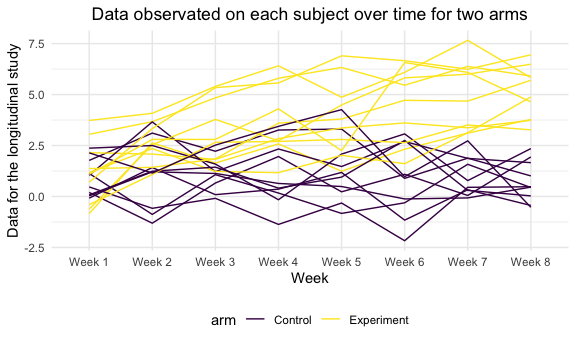

p8105_hw5_wb2366
================

``` r
library(tidyverse)
```

    ## ── Attaching packages ─────────────────────────────────────── tidyverse 1.3.1 ──

    ## ✓ ggplot2 3.3.5     ✓ purrr   0.3.4
    ## ✓ tibble  3.1.4     ✓ dplyr   1.0.7
    ## ✓ tidyr   1.1.3     ✓ stringr 1.4.0
    ## ✓ readr   2.0.1     ✓ forcats 0.5.1

    ## ── Conflicts ────────────────────────────────────────── tidyverse_conflicts() ──
    ## x dplyr::filter() masks stats::filter()
    ## x dplyr::lag()    masks stats::lag()

``` r
library(ggplot2)
knitr::opts_chunk$set(
  fig.width = 6,
  fig.asp = .6,
  out.width = "90%"
)

theme_set(theme_minimal() + theme(legend.position = "bottom"))
```

## Problem1

**Gather the data**

``` r
homicides_raw <- read_csv("./homicide-data.csv")
```

    ## Rows: 52179 Columns: 12

    ## ── Column specification ────────────────────────────────────────────────────────
    ## Delimiter: ","
    ## chr (9): uid, victim_last, victim_first, victim_race, victim_age, victim_sex...
    ## dbl (3): reported_date, lat, lon

    ## 
    ## ℹ Use `spec()` to retrieve the full column specification for this data.
    ## ℹ Specify the column types or set `show_col_types = FALSE` to quiet this message.

**Describe the raw data**

For this homicides raw dataset, it contains `52179` observations and
`12` variables, which are respectively
`uid, reported_date, victim_last, victim_first, victim_race, victim_age, victim_sex, city, state, lat, lon, disposition`

**Create a city_state variable and then summarize within cities to
obtain the total number of homicides and the number of unsolved
homicides**

``` r
homicides_df <- homicides_raw %>%
  janitor::clean_names() %>%
  mutate(
    city_state = str_c(city, '_', state),
    homicides_status = case_when(
      disposition == "Closed without arrest" ~ "unsolved",
      disposition == "Open/No arrest" ~ "unsolved",
      disposition == "Closed by arrest" ~ "solved"
    )
  ) %>% 
  group_by(city, homicides_status) %>% 
  tally()

knitr::kable(homicides_df)
```

| city           | homicides_status |    n |
|:---------------|:-----------------|-----:|
| Albuquerque    | solved           |  232 |
| Albuquerque    | unsolved         |  146 |
| Atlanta        | solved           |  600 |
| Atlanta        | unsolved         |  373 |
| Baltimore      | solved           | 1002 |
| Baltimore      | unsolved         | 1825 |
| Baton Rouge    | solved           |  228 |
| Baton Rouge    | unsolved         |  196 |
| Birmingham     | solved           |  453 |
| Birmingham     | unsolved         |  347 |
| Boston         | solved           |  304 |
| Boston         | unsolved         |  310 |
| Buffalo        | solved           |  202 |
| Buffalo        | unsolved         |  319 |
| Charlotte      | solved           |  481 |
| Charlotte      | unsolved         |  206 |
| Chicago        | solved           | 1462 |
| Chicago        | unsolved         | 4073 |
| Cincinnati     | solved           |  385 |
| Cincinnati     | unsolved         |  309 |
| Columbus       | solved           |  509 |
| Columbus       | unsolved         |  575 |
| Dallas         | solved           |  813 |
| Dallas         | unsolved         |  754 |
| Denver         | solved           |  143 |
| Denver         | unsolved         |  169 |
| Detroit        | solved           | 1037 |
| Detroit        | unsolved         | 1482 |
| Durham         | solved           |  175 |
| Durham         | unsolved         |  101 |
| Fort Worth     | solved           |  294 |
| Fort Worth     | unsolved         |  255 |
| Fresno         | solved           |  318 |
| Fresno         | unsolved         |  169 |
| Houston        | solved           | 1449 |
| Houston        | unsolved         | 1493 |
| Indianapolis   | solved           |  728 |
| Indianapolis   | unsolved         |  594 |
| Jacksonville   | solved           |  571 |
| Jacksonville   | unsolved         |  597 |
| Kansas City    | solved           |  704 |
| Kansas City    | unsolved         |  486 |
| Las Vegas      | solved           |  809 |
| Las Vegas      | unsolved         |  572 |
| Long Beach     | solved           |  222 |
| Long Beach     | unsolved         |  156 |
| Los Angeles    | solved           | 1151 |
| Los Angeles    | unsolved         | 1106 |
| Louisville     | solved           |  315 |
| Louisville     | unsolved         |  261 |
| Memphis        | solved           | 1031 |
| Memphis        | unsolved         |  483 |
| Miami          | solved           |  294 |
| Miami          | unsolved         |  450 |
| Milwaukee      | solved           |  712 |
| Milwaukee      | unsolved         |  403 |
| Minneapolis    | solved           |  179 |
| Minneapolis    | unsolved         |  187 |
| Nashville      | solved           |  489 |
| Nashville      | unsolved         |  278 |
| New Orleans    | solved           |  504 |
| New Orleans    | unsolved         |  930 |
| New York       | solved           |  384 |
| New York       | unsolved         |  243 |
| Oakland        | solved           |  439 |
| Oakland        | unsolved         |  508 |
| Oklahoma City  | solved           |  346 |
| Oklahoma City  | unsolved         |  326 |
| Omaha          | solved           |  240 |
| Omaha          | unsolved         |  169 |
| Philadelphia   | solved           | 1677 |
| Philadelphia   | unsolved         | 1360 |
| Phoenix        | solved           |  410 |
| Phoenix        | unsolved         |  504 |
| Pittsburgh     | solved           |  294 |
| Pittsburgh     | unsolved         |  337 |
| Richmond       | solved           |  316 |
| Richmond       | unsolved         |  113 |
| Sacramento     | solved           |  237 |
| Sacramento     | unsolved         |  139 |
| San Antonio    | solved           |  476 |
| San Antonio    | unsolved         |  357 |
| San Bernardino | solved           |  105 |
| San Bernardino | unsolved         |  170 |
| San Diego      | solved           |  286 |
| San Diego      | unsolved         |  175 |
| San Francisco  | solved           |  327 |
| San Francisco  | unsolved         |  336 |
| Savannah       | solved           |  131 |
| Savannah       | unsolved         |  115 |
| St. Louis      | solved           |  772 |
| St. Louis      | unsolved         |  905 |
| Stockton       | solved           |  178 |
| Stockton       | unsolved         |  266 |
| Tampa          | solved           |  113 |
| Tampa          | unsolved         |   95 |
| Tulsa          | solved           |  391 |
| Tulsa          | unsolved         |  193 |
| Washington     | solved           |  756 |
| Washington     | unsolved         |  589 |

## Problem2

**Create a tidy dataframe containing data from all participants,
including the subject ID, arm, and observations over time**

``` r
study_df_header <- list.files(path = "./data-2", pattern = "csv") %>% 
  as.data.frame() %>% 
  rename(subject_id = 1)

study_df_data <- list.files(path = "./data-2", pattern = "csv", full.names = T) %>% 
  map_df(read.csv) %>% 
  cbind(study_df_header,.) %>% 
  mutate(subject_id = str_sub(subject_id, end = 6)) %>% 
  separate(col = subject_id, into = c("arm", "subject_id")) %>% 
  pivot_longer(week_1:week_8,
               names_to = "week",
               values_to = "score")
```

**Make a spaghetti plot showing observations on each subject over time,
and comment on differences between groups.**

``` r
study_df_data %>%
  mutate(arm = case_when(arm == "con" ~ "Control",
                         arm == "exp" ~ "Experiment")) %>%
  ggplot(aes(
    x = week,
    y = score,
    color = arm,
    group = interaction(arm, subject_id)
  )) +
  geom_line() +
  labs(title = "Data observated on each subject over time for two arms",
       x = "Week",
       y = "Data for the longitudinal study") +
  scale_x_discrete(labels = c(
    "Week 1",
    "Week 2",
    "Week 3",
    "Week 4",
    "Week 5",
    "Week 6",
    "Week 7",
    "Week 8"
  )) +
  theme(plot.title = element_text(hjust = 0.5)) +
  viridis::scale_color_viridis(discrete = TRUE)
```



**Answer:** According to the “spaghetti” plot, when concentrating on the
difference between two groups, we are easy to figure out that the mean
data value for experiment arm is obviously larger than the mean data
value for control arm.

## Problem3

``` r
set.seed(10)

iris_with_missing = iris %>% 
  map_df(~replace(.x, sample(1:150, 20), NA)) %>%
  mutate(Species = as.character(Species))
```

**Write a function that takes a vector as an argument**

``` r
fill_missing = function(x){
  
  if(is.numeric(x)){
    x = replace(x, is.na(x), mean(x, na.rm = T))
  }
  else if(is.character(x)){
    x = replace(x, is.na(x), "virginica")
  }
  
  x
}
```

**replaces missing values using the rules defined above**

``` r
iris_df = map_df(.x = iris_with_missing, ~ fill_missing(.x))
```
